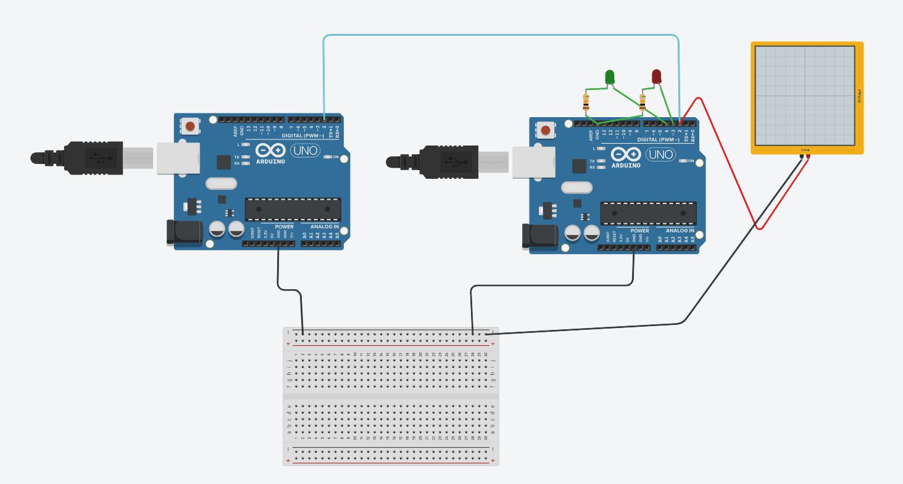

# 🛠️ Comunicação na Camada Física com Arduino e Codificação Manchester

Este projeto implementa um protocolo de comunicação personalizado entre dois microcontroladores (Arduino) utilizando a codificação Manchester para sincronização de clock e transmissão de dados. Desenvolvido no Tinkercad, o sistema permite enviar 4 comandos distintos para controlar LEDs remotamente.

---

## 📌 Funcionalidades
- **Transmissão de 4 mensagens:** `00`, `01`, `10`, `11`, cada uma acionando um comando diferente.
- **Codificação Manchester:** Garante sincronização entre transmissor e receptor.
- **Controle de LEDs:** Comandos para ligar/desligar LEDs vermelho e verde, além de um modo de alerta.

---

## 🧩 Componentes Utilizados
- 2x Arduino Uno (Transmissor e Receptor).
- 2x LEDs (Vermelho e Verde).
- 2x Resistores de 10kΩ (para LEDs).
- 1x Osciloscópio (simulado no Tinkercad).
- Protoboard.
- Jumpers.

---

## 🔌 Diagrama do Circuito

**Conexões:**
- **Transmissor (TX):** Pino digital 2 → Pino digital 2 do Receptor (RX).
- **Receptor (RX):** 
  - LED Vermelho → Pino 3.
  - LED Verde → Pino 4.
- **GND compartilhado** entre ambos os Arduinos e o osciloscópio.

---

## 📡 Protocolo de Comunicação

### Codificação Manchester
- **Bit 0:** Transição `HIGH → LOW` no meio do intervalo de tempo (500ms por bit).
- **Bit 1:** Transição `LOW → HIGH` no meio do intervalo de tempo.
- **Exemplo:** A mensagem `01` é codificada como:
  - `HIGH→LOW` (bit 0) → `LOW→HIGH` (bit 1).

### Mensagens e Comandos
| Mensagem | Ação                     |
|----------|--------------------------|
| `00`     | Liga LED Vermelho        |
| `01`     | Liga LED Verde           |
| `10`     | Desliga LEDs             |
| `11`     | Alerta (piscar LEDs 3x) |

---

## 🎥 Vídeo Explicativo
[🔗 **Link para o Vídeo no YouTube**](https://youtu.be/2ng5MBiueMg)